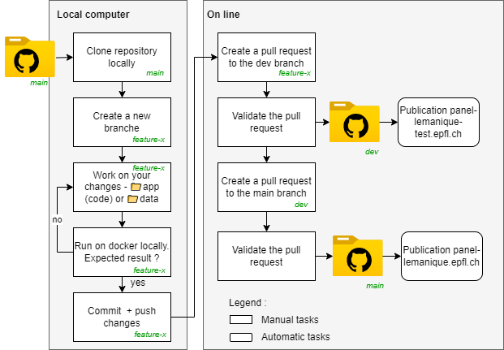

# LASUR-R-SHINY
Repository for a template R Shiny web application.


## Introduction

The purpose of this repository is to provide a comprehensive guide on how to host a R Shiny web application with Docker. 

Docker is a powerful tool that leverages containerization technology to streamline the deployment process of web applications. By following the steps outlined in this guide, you will gain a better understanding of how to containerize your R Shiny web application and deploy it to a production environment with ease.

## Repository stucture

📁 app - *folder containing the R application*

📁 data - *folder containing the data*

📁 install - *folder containing the installation files*

## Test environment

The test environment utilizes Docker to run the application in the same way it will run in production (on the internet). If it works locally with Docker, it will also work in production with Docker.

### Prerequisite

- Install Docker on your machine as explained on the [ENAC-IT4R web page](https://www.notion.so/Docker-quick-setup-278abe4712024abaaeea77e49a4c5b9f).
- (Optional) install Git as explained on the [ENAC-IT4R web page](https://www.notion.so/Install-Git-0a608fb1909f471284c189cf172c9016).

These are the only applications needed. R and Shiny are installed inside the Docker container.

### Installation

1. Clone or unzip the repository:
    
    ```bash
    git clone <https://github.com/EPFL-ENAC/LASUR-R-SHINY.git>
    
    ```
    
    or
    
    [https://github.com/EPFL-ENAC/LASUR-R-SHINY/archive/refs/heads/main.zip](https://github.com/EPFL-ENAC/LASUR-R-SHINY/archive/refs/heads/main.zip)
    
2. Open a command line window (PowerShell for Windows).
3. Navigate to the cloned or unzipped folder:
    
    ```bash
    cd <your_path>/LASUR-R-SHINY
    ```
    
4. Run the following command to create the Docker image:
    
    ```bash
    docker build -t poc_lasur_r_shiny .
    ```
    

The application has been installed locally on your computer.

### Run the Application

To load the data and start the app, run the following command:

- On Windows:
    
    ```bash
    docker run -p 3838:3838 -v ${pwd}/data/EPFL_vague1_extrait.csv:/srv/shiny-server/data.csv poc_lasur_r_shiny:latest
    
    ```
    
- On MAC/Linux:
    
    ```
    docker run -p 3838:3838 -v $(pwd)/data/EPFL_vague1_extrait.csv:/srv/shiny-server/data.csv poc_lasur_r_shiny:latest
    
    ```
    

Where `EPFL_vague1_extrait.csv` is the name of the data file.

The application should now be running in your web browser at [http://localhost:3838/](http://localhost:3838/).

## Production environment

To publish an application over the internet, a virtual machine must be provisioned within the EPFL IT infrastructure. Please contact ENAC-IT4R for further information.


## Conributing process

Here are the process to follow to contribute to this project :

